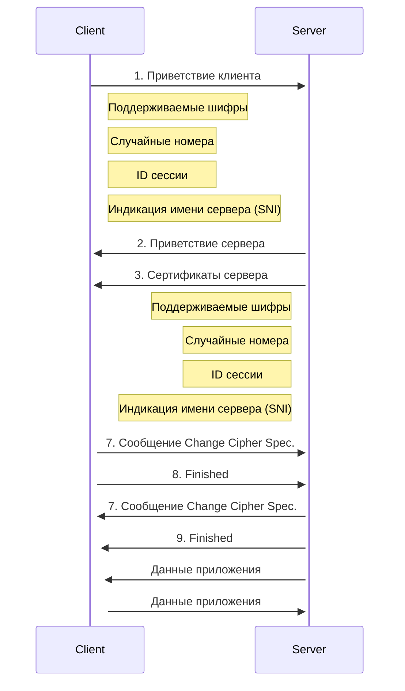

# Junior

## Общие

1. Что такое DevOps?
	
	**DevOps** — это набор *методик*, *инструментов* и *философия культуры*, которые позволяют автоматизировать и интегрировать между собой процессы команд разработки ПО и ИТ‑команд. Особое внимание в DevOps уделяется расширению возможностей команд, их взаимодействию и сотрудничеству, а также автоматизации технологий.
	Термин DevOps является комбинацией двух слов — development (разработка) и operations (эксплуатация) — и отражает процесс объединения этих практик в один непрерывный процесс.
	

2. Вы набираете *google.com* в браузере. Расскажите как можно подробнее, что происходит в это время?
	
	1. Enter **_google.com_**
	2. Проверка списка «предзагруженных HSTS (_HTTP Strict Transport Security_)». Это список сайтов, которые требуют, чтобы к ним обращались только по HTTPS.
	3. Если нужный сайт есть в этом списке, то браузер отправляет ему запрос через HTTPS вместо HTTP. В противном случае, начальный запрос посылается по HTTP. (При этом сайт может использовать политику HSTS, но не находиться в списке HSTS — в таком случае на первый запрос по HTTP будет отправлен ответ о том, что необходимо отправлять запросы по HTTPS. Однако это может сделать пользователя уязвимым к downgrade-атакам — чтобы этого избежать, в браузеры и включают список HSTS).
	4. **Определение DNS**
		- Браузер проверяет наличие домена в своём кэше.
		- Если домена там нет, то браузер вызывает библиотечную функцию _**gethostbyname**_ (отличается в разных ОС) для поиска нужного адреса.
		- Прежде, чем искать домен по DNS _**gethostbyname**_ пытается найти нужный адрес в файле _**hosts**_ (его расположение отличается в разных ОС).
		- Если домен нигде не закэширован и отсутствует в файле **_hosts_**, _**gethostbyname**_ отправляет запрос к сетевому DNS-серверу. Как правило, это локальный роутер или DNS-сервер Интернет-провайдера.
		- Если DNS-сервер находится в той же подсети, то ARP-запрос отправляется этому серверу.
		- Если DNS-сервер находится в другой подсети, то ARP-запрос отправляется на IP-адрес шлюза по умолчанию (default gateway).
		- _Порт 53 открывается для отправки UDP-запроса к DNS-серверу (если размер ответа слишком велик, будет использован TCP)._
		- _Если локальный или на стороне провайдера DNS-сервер «не знает» нужный адрес, то запрашивается рекурсивный поиск, который проходит по списку вышестоящих DNS-серверов, пока не будет найдена SOA-запись, а затем возвращается результат._
	5. Открытие сокета. Когда браузер получает IP-адрес конечного сервера, то он берёт эту информацию и данные об используемом порте из URL (80 порт для HTTP, 443 для HTTPS) и осуществляет вызов функции `socket` системной библиотеки и запрашивает поток TCP сокета — `AF_INET` и `SOCK_STREAM`.
	6. **TLS handshake**
		- Клиентский компьютер отправляет сообщение `ClientHello` серверу со своей версией протокола [TLS](https://ru.wikipedia.org/wiki/TLS), списком поддерживаемых алгоритмов шифрования и методов компрессии данных.
		- Сервер отвечает клиенту сообщением `ServerHello`, содержащим версию TLS, выбранный метод шифрования, выбранные методы компрессии и публичный сертификат сервиса, подписанный центром сертификации. Сертификат содержит публичный ключ, который будет использоваться клиентом для шифрования оставшейся части процедуры «рукопожатия» (`handshake`), пока не будет согласован симметричный ключ.
		- Клиент подтверждает сертификат сервера с помощью своего списка центров сертификации. Если сертификат подписан центром из списка, то серверу можно доверять, и клиент генерирует строку псевдослучайных байтов и шифрует её с помощью публичного ключа сервера. Эти случайные байты могут быть использованы для определения симметричного ключа.
		- Сервер расшифровывает случайные байты с помощью своего секретного ключа и использует эти байты для генерации своей копии симметричного мастер-ключа.
		- Клиент отправляет серверу сообщение `Finished`, шифруя хеш передачи с помощью симметричного ключа.
		- Сервер генерирует собственный хеш, а затем расшифровывает полученный от клиента хеш, чтобы проверить, совпадёт ли он с собственным. Если совпадение обнаружено, сервер отправляет клиенту собственный ответ `Finished`, также зашифрованный симметричным ключом.
		- После этого TLS-сессия передаёт данные приложения (HTTP), зашифрованные с помощью подтверждённого симметричного ключа.
		1. **Протокол HTTP**. Если клиент использует HTTP-протокол и не поддерживает SPDY (используемый в браузерах от Google), то отправляет серверу запрос следующей формы:
		
		```
		GET / HTTP/1.1
		Host: google.com
		Connection: close
		[другие заголовки]
		```
		
		где `[другие заголовки]` — это серия пар «ключ: значение», разбитых переносом строки. (Здесь предполагается, что в использованном браузере нет никаких ошибок, нарушающих спецификацию HTTP. Также предполагается, что браузер использует `HTTP/1.1`, в противном случае он может не включать заголовок `Host` в запрос и версия, отданная в ответ на GET-запрос может быть `HTTP/1.0` или `HTTP/0.9`).
		`HTTP/1.1` определяет опцию закрытия соединения («close») для отправителя — с её помощью происходит уведомление о закрытии соединения после завершения ответа. К примеру:
		
		> [!tip] Connection: close
		  
		Приложения `HTTP/1.1`, которые не поддерживают постоянные соединения, обязаны включать опцию «close» в каждое сообщение.
		После отправки запроса и заголовков, браузер отправляет серверу единичную пустую строку, сигнализируя о том, что содержимое сообщения закончилось.
		Сервер отвечает специальным кодом, который обозначает статус запроса и включает ответ следующей формы:
		
		```
		200 OK
		[заголовки ответа]
		```
		
		После этого посылается пустая строка, а затем оставшийся контент HTML-страницы [www.google.com](http://www.google.com/). Сервер может затем закрыть соединение, или, если того требуют отправленные клиентом заголовки, сохранять соединение открытым для его использования следующими запросами.
		Если HTTP-заголовки отправленные веб-браузером включают информацию, которой серверу достаточно для определения версии файла, закэшированного в браузере и этот файл не менялся со времени последнего запроса, то ответ может принять следующую форму:
		
		```
		304 Not Modified
		[заголовки ответа]
		```
		
		и, соответственно, клиенту не посылается никакого контента, вместо этого браузер «достаёт» HTML из кэша.
		После разбора HTML, браузер (и сервер) повторяет процесс загрузки для каждого ресурса (изображения, стили, скрипты, favicon.ico и так далее), на который ссылается HTML-страница, но при этом изменяется адрес каждого запроса c `GET / HTTP/1.1` на `[](http://www.google.com/)GET /$(относительный URL ресурса www.google.com) HTTP/1.1`.
		Если HTML ссылается на ресурс, размещённый на домене, отличном от google.com, то браузер возвращается к шагам, включающим разрешение доменного имени, а затем заново проходит процесс до текущего состояния, но уже для другого домена. Заголовок `Host` в запросе вместо google.com будет установлен на нужное доменное имя.
	

3. Как работает HTTPS?
	
	HTTPS — это не совсем протокол. Это расширение HTTP-протокола — объединение двух протоколов: HTTP и SSL или HTTP и TLS. 
	Протоколы **TLS** (Transport Layer Security) и **SSL** (Secure Socket Layer) — криптографические. Это значит, что они позволяют шифровать данные, в нашем случае те, что передаются между браузером и сервером. Расшифровать эти данные могут только сервер и браузер, для всех остальных это будет набор нечитаемых символов.
	
	> [!tip] TLS основан на SSL, но второй уже устарел, и вместо него используют TLS.
	
	У ресурса/сайта, поддерживающего HTTPS, есть SSL/TLS-сертификат, который выдается центром сертификации. Если у ресурса в адресной строке есть зеленый замок, соединение с ним защищено.
	
	> [!tip] Посмотреть информацию о сертификате и его подлинности можно, нажав на значок.
	
	Как правило, SSL/TLS-сертификат — это подтверждение, что ресурс настоящий. Но могут быть исключения: сертификат может быть выдан легитимным центром на фишинговый сайт. В таком случае важно совпадение CN в сертификате с доменным именем сайта и уверенность пользователя в этом имени.
	Перед тем как запустить HTTP-соединение, браузер обращается к серверу, чтобы наладить защищенное соединение. Сервер отправляет копию сертификата безопасности в ответ. 
	Браузер проверяет данные по своим спискам доверенных центров (список есть в каждом браузере), проверяет совпадение CN с доменным именем, даты выпуска и срока окончания сертификата, отсутствие в CRL, поддерживаемые алгоритмы, наличие издателя в списке доверенных корневых сертификатов и в списке доверенных издателей. В случае проблем на любой из этих проверок сертификат считается не валидным.
	Если все хорошо, то браузер считает ресурс безопасным: они выбирают алгоритм шифрования, обмениваются ключом шифрования и потом данными по протоколу HTTP.
	Схематически это выглядит так:
	
	![[http-tls-ssl.png]]
	



4. Объясните концепцию Infrastructure as Code, зачем это нужно и какие проблемы решает?

 

## Linux

5. Опишите общую архитектуру операционной системы.

6. Опишите основное предназначение операционной системы.

7. Зачем нужны файловые системы? Какие существуют?

8. В чем разница между виртуализацией и контейнеризацией?
	
	![[Container_Evolution.svg]]
	
	**Традиционная эра развертывания:** Ранее организации запускали приложения на физических серверах. Не было никакого способа определить границы ресурсов для приложений на физическом сервере, и это вызвало проблемы с распределением ресурсов. Например, если несколько приложений выполняются на физическом сервере, могут быть случаи, когда одно приложение будет занимать большую часть ресурсов, и в результате чего другие приложения будут работать хуже. Решением этого было запустить каждое приложение на другом физическом сервере. Но это не масштабировалось, поскольку ресурсы использовались не полностью, из-за чего организациям было накладно поддерживать множество физических серверов.
	
	**Эра виртуального развертывания:** В качестве решения была представлена виртуализация. Она позволила запускать несколько виртуальных машин (ВМ) на одном физическом сервере. Виртуализация изолирует приложения между виртуальными машинами и обеспечивает определенный уровень безопасности, поскольку информация одного приложения не может быть свободно доступна другому приложению.
	Виртуализация позволяет лучше использовать ресурсы на физическом сервере и обеспечивает лучшую масштабируемость, поскольку приложение можно легко добавить или обновить, кроме этого снижаются затраты на оборудование и многое другое. С помощью виртуализации можно превратить набор физических ресурсов в кластер одноразовых виртуальных машин.
	Каждая виртуальная машина представляет собой полноценную машину, на которой выполняются все компоненты, включая собственную операционную систему, поверх виртуализированного оборудования.
	
	**Эра контейнеров:** Контейнеры похожи на виртуальные машины, но у них есть свойства изоляции для совместного использования операционной системы (ОС) между приложениями. Поэтому контейнеры считаются легкими. Подобно виртуальной машине, контейнер имеет свою собственную файловую систему, процессор, память, пространство процесса и многое другое. Поскольку они не связаны с базовой инфраструктурой, они переносимы между облаками и дистрибутивами ОС.	
	

9. В чем преимущества контейнеров?
	
	Контейнеры стали популярными из-за таких дополнительных преимуществ как:	
	- Гибкое создание и развертывание приложений: простота и эффективность создания образа контейнера по сравнению с использованием образа виртуальной машины.
	- Непрерывная разработка, интеграция и развертывание: обеспечивает надежную и частую сборку и развертывание образа контейнера с быстрым и простым откатом (благодаря неизменности образа).
	- Разделение задач между Dev и Ops: создавайте образы контейнеров приложений во время сборки/релиза, а не во время развертывания, тем самым отделяя приложения от инфраструктуры.
	- Наблюдаемость охватывает не только информацию и метрики на уровне ОС, но также информацию о работоспособности приложений и другие сигналы.
	- Идентичная окружающая среда при разработке, тестировании и релизе: на ноутбуке работает так же, как и в облаке.
	- Переносимость облачных и операционных систем: работает на Ubuntu, RHEL, CoreOS, on-prem, Google Kubernetes Engine и в любом другом месте.
	- Управление, ориентированное на приложения: повышает уровень абстракции от запуска ОС на виртуальном оборудовании до запуска приложения в ОС с использованием логических ресурсов.
	- Слабосвязанные, распределенные, гибкие, выделенные микросервисы: вместо монолитного стека на одной большой выделенной машине, приложения разбиты на более мелкие независимые части, которые можно динамически развертывать и управлять.
	- Изоляция ресурсов: предсказуемая производительность приложения.
	- Грамотное использование ресурсов: высокая эффективность и компактность.
	

10. Какова файловая структура в Linux (UNIX) системах, расположенных в */etc*, */dev*, */proc*, */sys*, */lib*, */var* (несколько директорий на выбор)?

11. Что такое Load Average?

12. В чем разница между soft и hard symlink?

13. Как работают file permissions, зачем директории права исполнения (`+x`)?

14. Что такое zombie process?

15. С помощью чего можно собрать информацию о текущем состоянии процессора, памяти, диска, сети?

16. Что такое *vm.swappiness*?

17. Как посмотреть свободное место на диске?

18. Что такое *inode*?

19. Расскажите поэтапно процесс загрузки Linux с момента включения питания компьютера.

20. Что произойдет при выполнении команд:

	1. `cat file1 > file2`
	
	2. `cat file1 >> file2`

21. В чем разница между *Ctrl+C* и *Ctrl+Z*?
	
	- `Ctrl+C` — если мы хотим завершить работу нашего сервера,
	- `Ctrl+Z` — если мы хотим приостановить и потом продолжить работу нашего сервера. (***запуск сервера приостановлен, а не завершен!** И из-за этого сервер каждый раз запускается на новом порту, если это предусмотрено в коде, или же будет выдавать ошибку, что тот порт уже занят! Возобновить работу можно с помощью команды: `fg`*)
	

22. Как перенаправить одновременно *stderr* и *stdin*?

23. Как убить процесс? Какие есть типы сигналов?

24. Что делает команда `grep`?
	
	Используется для поиска строк в файлах, которые соответствуют заданному шаблону.
	Основные функции команды `grep`:
	* **Поиск текста:** `grep` может находить строки, содержащие заданный текст (например, `grep "hello" file.txt` найдет строки в файле `file.txt`, содержащие слово "hello").
	* **Использование регулярных выражений:** `grep` поддерживает использование регулярных выражений для более сложного поиска (например, `grep "h.*o" file.txt` найдет строки, начинающиеся с "h" и заканчивающиеся на "o").
	* **Выдача результатов:** `grep` может выводить найденные строки в консоль, а также выполнять дополнительные действия, такие как подсчет совпадений, вывод номеров строк, вывод только имен файлов, содержащих совпадения, и т.д.
	* **Обработка нескольких файлов:** `grep` может обрабатывать сразу несколько файлов, используя символ "`*`" (например, `grep "hello" *.txt` найдет все строки, содержащие "hello" во всех файлах с расширением .txt в текущей директории).
	
	Основные опции команды `grep`:
	* `-i`: Поиск без учета регистра  
	* `-v`: Вывод строк, *не* содержащих заданный шаблон  
	* `-n`: Вывод номеров строк, содержащих совпадения  
	* `-c`: Вывод только количества совпадений  
	* `-l`: Вывод имен файлов, содержащих совпадения  
	* `-w`: Совпадение только с целыми словами  
	* `-E`: Использование расширенных регулярных выражений
	

25. Что такое скрипт bash?

26. Какие типы переменных используются в bash?

27. Что выведут команды:

	1. `echo ${hostname};`
	
	2. `echo $(hostname);`

 
## Networks

28. Что такое модель OSI, TCP/IP?

29. Для чего нужны network masks?

30. Структура IP-пакета. Из чего состоит? Что такое фрагментация и почему она происходит?

31. Что такое коллизия? Почему возникает?

32. Что такое прокси?

33. Что такое firewalls и зачем они нужны?

34. Что такое NAT и для чего он нужен?

35. Какие типы IP-адресов вы знаете?

36. По какому порту и протоколу работают Ping и Traceroute?

 
## Clouds

37. В чем разница между IaaS, PaaS и SaaS?

38. Что такое VPC и из каких компонентов должно состоять?

39. Что такое cloud-init? init/systemd/upstart configs?

 

## Automation

40. Что такое IaaC и зачем он нужен?

41. Что такое Terraform?

42. Какие инструменты автоматизации вы знаете?

 
## Information Security

43. В чем разница между аутентификацией и авторизацией?

44. Сертификаты. Как работает HTTPS? Что такое certificate ciphers?

45. Как безопасно передать данные своему коллеге?

46. ​​Что такое MFA, TOTP?

 
## Виртуализация

47. В чем разница между виртуализацией и контейнеризацией? В чем плюсы и минусы?

48. Как при запуске Docker-контейнера «повесить» его из 80-го порта в контейнере на 8081 на хост?

49. Как передать в виртуальную машину USB device?

50. Docker-контейнер потребляет многие SWAP. Что делать?

 
## CI/CD

51. Что такое Continuous Integration и Continuous Deployment? В чем разница между Continuous Deployment и Continuous Delivery?

52. Опишите основные этапы CI/CD.

53. Опишите пример процесса CI (и/или CD), который начинается с момента, когда разработчик запушил изменения/PR в Git?

54. Расскажите о разновидностях тестов, которые мы можем использовать в CI пайплайне.

55. Какие инструменты CI вы использовали? Есть ли опыт работы с Jenkinsfile?

56. Какие виды тестов вы знаете и зачем они нужны?

 
## Development

57. Git. Как решить merge conflict? Что такое `rebase`, `cherry-pick`?

58. В чем разница между `git merge` и `git rebase`?

59. Какие UI использовали?

60. Какая разница между GitLab/GitHub/Bitbucket?

61. Какая разница между `git pull`/`git fetch`?

62. Что такое Git-Flow?

63. Версионирование. Какая разница между SemVer и CalVer?

64. Тестирование. Какие существуют виды? Как писать тесты, TDD?

65. В чем разница между компилируемыми и интерпретационными языками программирования?

 
## Monitoring/Logging

66. Какие метрики нужно собирать? Разница между infrastructure и application monitoring.

67. Какая разница между pull и push model в системах мониторинга?

68. Какая разница между Black box и White box monitoring?

69. Расскажите о подходах к сбору application логов.

 
## Практические задания

71. Напишите простую программу на ваш выбор. Программа должна получать сообщения из сервиса очередей и печатать его в *stdout*. Сервис очередей — по вашему усмотрению.

72. Разберите структуру сервиса (на примере Docker-Compose).

73. Практическая сессия работы с Git (Git command line: `fetch`, `push`, `pull`, `rebase`, `checkout`, `submodules`).

 
# Middle

## Linux

1. Опишите архитектуру ядра Linux.

2. Что такое ядро ​​и каково его предназначение?

3. Опишите общие части файловой системы Unix/Linux, архитектуру файловой системы.

4. В чем разница между RedHat и Debian?

5. В чем разница между */proc* и */sys*?

6. Ситуация: указывает, что на диске занято 50% места, а сделать файл даже под root юзером не можем. В чем проблема?

7. Мы удалили файл, открывший приложение. Как нам его восстановить?

8. Как найти PID процесса, его стартовые параметры?

9. Как проверить, открыт ли порт на удаленном хосте, локальном хосте?

10. Как искать файл по его содержимому?

11. Что такое SSH, как организовать доступ на сервер без пароля или с определенных хостов? Как ограничить доступные для выполнения команды?

12. Как проверить потреблённые ресурсы во время сеанса SSH?

13. Что означает разрешение на файл 755?

14. Что такое SELinux и зачем он нужен?

15. Как определить PCI-устройство в системе, например, RAID controller?

16. Как переименовать устройство, например, сетевую карту или диск?

17. Что такое LVM? Какие знаете примеры использования?

18. Что такое root reserved space?

19. Что такое exit code и как его узнать?

20. Почему вывод `df -h` указывает, что на диске занято мало места, но система не дает записать файл с сообщением “no space left on device”?

21. В чем разница между `command1 & command2` и `command1 && command2`, а также `command1 && command2 || command3`?

22. Из сети резко вырос исходящий трафик на 25-й порт. Как, имея доступ на gateway, обнаружить вредителя из внутренней сети?

23. Как затюнить параметры Linux Kernel?

24. Что такое ulimits?

25. В чем разница между символическими и hard links?

26. Что такое фрагментация *ext3* и *ext4*?

27. Зачем файловые системы *ext\** резервируют 5% места?

28. Как увеличить размер файловой системы?

29. Можем ли мы уменьшить размер файловой системы?

30. Что такое `chroot` и для чего он нужен?

31. У нас есть Linux box с 2 Гб оперативной памяти и Java-приложение, которое пытается выделить 4 Гб во время запуска. Удастся ли это?

32. Есть приложение, которое читает файл, который пользователь пытается удалить. Что случится? Можно ли удалить этот файл? Можно ли восстановить этот файл?

33. Какие механизмы создания процессов в Linux вы знаете?

34. Сравните *systemd* и *init system*.

35. У вас есть папка с большим количеством файлов, и вы хотите удалить все файлы с именами, начинающимися на A (прописная буква). Но команда `rm –f A*` выдает Argument list too long. Как удалить эти файлы?

36. Вы начинаете удалять файлы первым методом из предыдущего вопроса, но каждый `rm` запрашивает подтверждение. Это очень долго. Как можно ускорить эту операцию?

 
## Networks

37. Расскажите о модели OSI. Опишите функции и назначение каждого уровня.

38. Какие сетевые топологии вы знаете? Опишите разницу между ними.

39. Зачем нужен IP-адрес, если MAC-адрес уникален? Разве мы не можем общаться только по MAC-адресу?

40. В чем разница между концентратором и коммутатором L2 в сетях Ethernet?

41. Что такое VLAN и для чего существует разделение на виртуальные локальные сети?

42. Какой номер порта используется для PING-коммуникации?

43. Что такое сеанс связи? Какой алгоритм использует TCP для доставки?

44. В чем основное отличие между TCP и UDP?

45. Зачем нам маршрутизатор по умолчанию?

46. Как хост решает DNS по умолчанию?

47. Компьютер начал получать IP-адрес из другой сети (есть подозрение, что в сети работает другой DHCP-сервер): как его найти и отключить? Какие методы защиты от такой проблемы?

48. Мы будем мигрировать сайт на новый IP-адрес. Как сделать, чтобы пользователи этого практически не заметили?

49. Что такое socket?

50. Как узнать, какие удаленные хосты подключаются к хосту через порт 8888? (с помощью команд и не используя */proc* или */sys*).

51. У нас есть несколько сетевых карт. Как увеличить пропускную способность сервера?

52. Как проверить открытые порты на удаленном сервере без команд Netcat или Nmap Linux?

 
## Container orchestration

53. В чем преимущества Kubernetes как платформы?

54. Что такое control plane и из каких компонентов состоит?

55. Какие CNI вы использовали и чем они отличаются?

56. Чем отличается managed Kubernetes от self-deployed?

57. Как можно контролировать размещение подов в кластере? (taints/tolerations, affinities, topologies etc.)

58. Скейлинг кластера. Cluster autoscaler vs HPA vs VPA? Как сделать zero-downtime node decommission/cluster upgrade? PDB? Lifecycle hooks?

59. Какие способы для внешнего доступа к кластеру? *ingress*, *node port*, *port-forward* и т. д.

60. С каким PID запускается процесс в контейнере?

61. Что лучше использовать для изоляции окружения – Vagrant или Docker?

62. Какой инструмент оркестрирования контейнеров использовали? (Swarm, Kubernetes, Openshift, Rancher и т. д.)

63. Что происходит в Kubernetes после запуска kubectl (API, ReplicaSet Controller, storage back-end, scheduler, kubelet, worker node, pod)?

64. Какая разница между pod и контейнером в K8s?

65. Как мы можем сделать любой микросервис, работающий на K8s, доступным из внешней среды?


## Виртуализация и контейнеризация

66. Какие типы виртуализации вы знаете?

67. Как работает Docker на macOS/Windows?

68. Что такое Docker-image и Docker-контейнер? Как они между собой связаны?

69. Каковы основные отличия между контейнерами докеров и виртуальными машинами?

70. Что такое image layer? Какое максимальное количество layers возможно? Почему нужно пытаться иметь малое количество layers? Какое оптимальное количество?

71. Как в виртуальной машине изменить размер диска после создания? Что нужно сделать с гостевой ОС?

72. Как в Docker реализовано ограничение ресурсов?

73. Существует виртуальная машина, к которой потерян доступ. Как, имея доступ к диску, восстановить root пароль/SSH-ключ?

74. Оптимизировать Dockerfile, объяснить, что и почему так:

```yaml
FROM golang
RUN apt install -y pkg1 pkg2 pkgN # Dependencies for app
COPY. .
RUN go build -o app main.go
CMD ./app
```

75. Что такое IPVS и какой у него функционал?

76. Какова структура API в Kubernetes?

77. Что такое operators и зачем они нужны?


## CI/CD

78. Какие стадии должны быть в любом пайплайне (lint, test, build, deploy etc.)?

79. Как и где хранить build artifacts?

80. Что такое артефакт?

81. Есть два бренча: dev и stage. Мы забросили Dockerfile в dev, а затем сбилдили в dev и stage. Это будет одним артефактом или разными?

82. Что вы использовали для автоматизации настройки Jenkins и GitLab CI?

83. Сравните CI инструментов: Jenkins, GitLab CI, AWS Code Pipeline, GCP cloudbuild, GitHub actions, Circle CI.

84. Deployment strategies. Какие существуют и чем отличаются (recreate, blue-green, canary etc.)?

85. Как реализовать СI/CD для программы, которая зависит от нескольких других программ?

86. GitOps. В чем его преимущества и недостатки?


## Clouds and Automation

87. Какова роль и преимущества облачных сервисов для DevOps?

88. Что такое immutable infrastructure? Как достичь? В чем преимущества и недостатки? Packer, AMI и т. д.

89. Структура Terraform. Как организовать multi-environment project? Terraform workspaces?

90. Лучшие практики по использованию многих Terraform states.

91. Как организовать доступ команде разработчиков к AWS/GCP/Azure? Role-based access, assume role, SSO.

92. Что такое Terraform provider, module?

93. Как версионировать Terraform modules?

94. Когда нужно использовать local-exec и remote-exec?

95. Что такое golden image и как его создать?

 
## Monitoring/Logging

96. Как мониторинг помогает поддерживать всю архитектуру системы?

97. Какие инструменты мониторинга вы использовали?

98. Что такое медиана и процентиль?

99. Что такое SLI, SLO, SLA? Зачем это нужно?

100. Архитектура системы для сбора логов, ELK, EFK etc. Как сохранить logs при отказе хранилища? Нужно ли использовать для этого брокер сообщений? Нужно ли делать throttling / rate limits?

101. Prometheus long-term storage. Какие варианты?

102. Как работает Prometheus?

103. В чем принципиальное отличие между Grafana и Kibana?

104. В чем главное отличие между *Ansible* and *Terraform*?

105. Что такое SAAS monitoring и какие виды знаете?

106. Если вы используете *Datadog* / *NewRelic*, то как нам отслеживать падение инструментов мониторинга?

107. Что такое distributed tracing и error tracking systems? Как вы думаете, когда следует их использовать?

 
## Information Security

108. В чем разница между *RBAC* и *ABAC*?

109. В чем заключается XSS атака? SQL injection? Что такое CSP?

110. Какие базовые меры можно предпринять для защиты SSH-соединения?

111. Root-пароль неизвестен или потерян. Какова процедура восстановления?

112. Как управлять правами на файловой системе в Linux?

113. Что такое Firewall?

114. Чем отличается stateless от stateful firewalls?

115. Сколько таблиц в `iptables`?

116. Можно ли настроить трансляцию NAT с помощью `iptables`? Какую таблицу следует использовать?

117. Какую таблицу используют для смены заголовков пакетов?

118. Если вам ломают Linux-сервер, то как более эффективно блокировать трафик с IP-адресов?

119. Принцип работы GCP Firewall: можем ли мы профильтровать трафик на Load Balancer?

120. Что такое SELinux?

121. Можно ли полностью отключить SELinux на лету?

122. С какими secrets management systems вы работали?

123. У нас есть сервер NAT, и мы хотим обеспечить доступ по IP к серверу снаружи. Как нам это реализовать?

123. Чтобы попасть на сервер клиента, нужно залогиниться на 4+ jump хоста. Как автоматизировать? Где мы будем хранить наш SSH-ключ?

 
## Development

125. Что такое cookies? Зачем нужны? JWT?

126. Что такое feature toggles и зачем они?

127. Что такое TDD (Test Driven Development) и BDD (Behavior Driven Development)?

 
## Databases

128. Что такое индекс и что такое ключ?

129. Каковы преимущества и недостатки индексов?

130. Представьте, что вы разрабатываете систему биллинга, которая должна обрабатывать тысячи счетов. Какую стратегию обновления данных вы бы выбрали?

131. Какие методы чаще всего используют для масштабирования реляционных баз данных?

132. Опишите механизм транзакций БД.

133. Как мы можем удалить таблицу или базу данных?

134. Как найти медленные запросы в MySQL/PostgreSQL?

135. Какие SQL-операторы манипулирования данными вы знаете?

136. Можно ли вывести список баз данных/таблиц через CLI? Как мы можем переключаться между базами данных MySQL/PostgreSQL?

137. Какие storage engines в MySQL вы знаете? Какие отличия?

138. Как реализована репликация MySQL master-master? Сколько серверов MySQL может быть задействовано в таком взаимодействии?

139. Как работает репликация MySQL/PostgreSQL? Какие параметры должны быть настроены для репликации?

140. Сравните SQL и NoSQL.

141. Sharding vs replication?

142. Какие есть виды индексов? Когда и зачем использовать?

143. Требования к схеме БД. Character sets, collations, default, not null и т. д.

144. Мы мигрируем MySQL/PostgreSQL из on-prem в облако. Как нам это сделать с минимальным downtime?

145. Зачем и как тестировать перформанс баз данных?

 
## Практические задания

146. Напишите Terraform module для инфраструктуры тестового сервиса в AWS.

147. Напишите hello-world программу на ваш выбор и сформируйте для нее *helm chart* / *helm kustomize*.

148. Как организовать deploy без downtime?

149. Опишите способы troubleshooting для Docker-контейнера.

150. Разобрать и объяснить структуру CI/CD pipeline (на примере `gitlab.yml`).

151. Продемонстрируйте навыки работы с GitOps, опишите deployment простенькой программы.

152. Как организовать deploy веб-приложения, запущенный на нескольких серверах без (или с минимальным) downtime?

153. Как с помощью Ansible узнать default gateway для пула серверов, и, если он отличается от желаемого, записать строчку «hostname: gateway» в файл на локальной машине?
